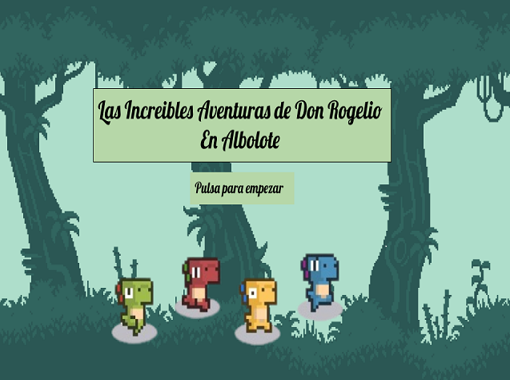

# 2D Game

  

The purpose of this project is to create a 2D game based on SuperKoalio for educational purposes.

To do this, I used Java 8, Gradle and the [libGDX](https://libgdx.com/) framework.

## How to run it

To launch the project just execute the following commands:

``` bash
./gradlew lwjgl3:jar
./gradlew lwjgl3:run
```
